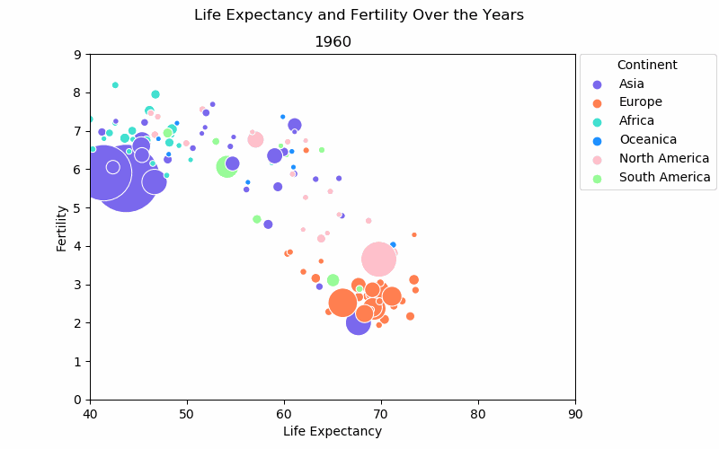

# Animated Graph for Fertility vs Birth Rate Data Over the Years

One of the first videos that got me fasinated with data was Hans Rosling's presentation of 200 Countries, 200 Years in 4 Minutes ([YouTube link](https://youtu.be/jbkSRLYSojo)). It was fasinating how interesting data can be and how much data visualization can do. Of course, once I started to do more research on data science, I realized there was much more to it than what was in that presentation, but the video stuck with me.

That's why I thought it would be interesting to recreate a similar graph. Of course, there are many data visualization tools out there that would make the process simple, but I thought doing it in Python would be an interesting process. So that's what I did.

This project is done using Python 3, with Matplotlib, and Seaborn.

## Data

Three sets of data are obtained from [WorldBank.org](https://www.worldbank.org/):
* Annual World Fertility Rate by Country from 1960
* Annual World Life Expectancy by Country from 1960
* Annual World Population by Country from 160

### Data Cleaning

These datasets had no information on 2019 & 2020 and there were some countries with no information at all throughout the years. These years and countries were deleted from the dataset.

For the countries with data, the majority has full data from 1960, but some has missing data. The majority of the missing data were from the earlier years, but some also has missing data from later years where there were data collected from the year(s) prior and year(s) after.

Since this was more of data visualization exercise, for convinence sake I chose to forward fill the NaN values, assuming the numbers remained constant until the next available data point.

Using <pycountry_convert>, the countries a column for continent was added based on the country names and any names that were not recognized as a country was deleted.

Finally, I ensured that the three data sets contained the same countries.

## Graph

Placing the data in a graph was relatively simple. The biggest challenge was making it more esthetically pleasing and getting rid of items I did not want to show on the legends. Once the graph was plotted an animated, it was saved in <.gif> format.

Here's the final product:
</img>

## Referenced Articles
[Learn How to Create Animated Graphs in Python](https://towardsdatascience.com/learn-how-to-create-animated-graphs-in-python-fce780421afe)
[Making an Animated Graph with Matplotlib & Seaborn](https://salernoali.medium.com/making-an-animated-graph-with-matplotlib-seaborn-3f865fa8c16a)
